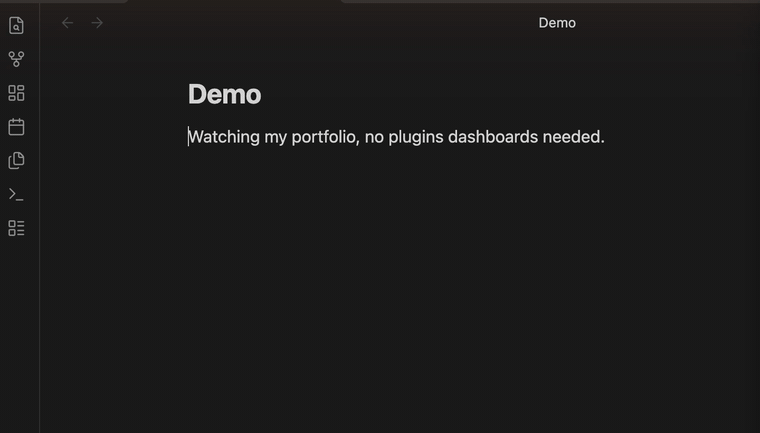

# Stonks 📈

[](https://github.com/dmgx0/obsidian-stonks/actions/workflows/ci.yml)
[](https://github.com/dmgx0/obsidian-stonks/releases/latest)
[](LICENSE)

Live stock, ETF, and crypto prices that **materialize inline** in your notes. Type a ticker, get the current value — right where you wrote it, in both editing and reading views, auto-refreshing, and working on mobile.



Unlike block-based finance plugins, Stonks puts the *raw number* in your text so you can build **your own** portfolio math with simple expressions. It does not lock you into a fixed dashboard.

- **Lightweight** — one small file, zero runtime dependencies, no bundled charting library.
- **Flexible** — you get the raw number plus a tiny expression engine, so you can build your own portfolio math (or hand the quotes to Dataview / JS).
- **Plays nice** — claims only inline code starting with `$:`, so it coexists with Dataview, Numerals, and other inline-code plugins.
- **Private & mobile-safe** — only ticker symbols ever leave your device, fetched through Obsidian's own network layer.

## How it works

Write inline code starting with `$:`:

| You type | You get |
| --- | --- |
| `` `$: VWRA.L` `` | the live price, formatted in its own currency |
| `` `$: AAPL` `` | `$184.21` |
| `` `$: VWRA.L * 100 + 500` `` | a computed value (your quantities × live price) |
| `` `$: VWRA.L * 100 + MSFT * 5` `` | multiple tickers in one expression |

Tickers are whatever Yahoo Finance understands: `MSFT`, `VWRA.L`, `CSPX.L`, `BTC-USD`, `BRK-B`, `^GSPC`, …

As you type inside a `$:` span, Stonks **autocompletes**: tickers you've used (with their cached price), fields after a `.`, modifiers after a `|`, and `@variables` from your properties (with their values).

A bare ticker is the **price**; add a **field** with dot-notation (Excel-Stocks / Dataview style):

| You type | You get |
| --- | --- |
| `` `$: AAPL.change` `` | today's change, signed |
| `` `$: AAPL.pct` `` | today's % change, signed |
| `` `$: AAPL.prev` `` | the previous close |

The exchange suffix is preserved — `VWRA.L.pct` is the ETF `VWRA.L`'s % change; only a known field name is peeled off the end.

The expression engine is tiny on purpose: `+ - * / %`, parentheses, numbers, and tickers. For anything heavier (units, currency conversion, spreadsheets), reach for [Numerals](https://github.com/gtg922r/obsidian-numerals) — see below.

> **Tip:** put spaces around a minus used for subtraction — `AAPL - 100`. Without them, `AAPL-100` reads as a single ticker, since dashes are valid in symbols like `BRK-B` and `BTC-USD`.

> **Tip:** Obsidian reads `$…$` as a LaTeX formula. A loose `$` in your prose can pair with the `$` in a nearby `$:` value and break the line — write such amounts as `100 USD`, or escape the sign (`\$100`), when they share a line with a `$:` expression.

## Colour that means something

Every value colours green/red by its **own day move** — Stonks re-evaluates the expression at yesterday's closes and compares. So a position (`AAPL * 25`) moves with its ticker, a portfolio total moves with the weighted whole, inverse exposure (`100 / AAPL`) inverts correctly, and a cost-basis constant doesn't distort the move. Bare FX rates stay neutral (no "up is good" direction).

Want different? Append **display modifiers** after a `|`:

| You type | You get |
| --- | --- |
| `` `$: AAPL * 25 - 3200 \| sign` `` | coloured by the value's own sign — gain green, loss red |
| `` `$: AAPL * 25 \| plain` `` | no colouring |
| `` `$: AAPL + MSFT \| 0` `` | zero decimals, just for this value |
| `` `$: AAPL.change * 25 \| +` `` | always show the sign |
| `` `$: BTC-USD * 0.25 \| compact` `` | `$15K`-style compact notation |
| `` `$: AAPL * USDGBP=X \| gbp` `` | label the result a currency (you did the conversion; also lifts the mixed-currency flag) |

Modifiers combine: `` `\| sign 0` ``. Inside a markdown table, escape the pipe as `\|` — that's a markdown rule, and Stonks understands both spellings.

## Variables from note properties

Keep your numbers in the note's **properties** (frontmatter) and reference them with `@`:

```yaml
---
qty_aapl: 25
cost_basis: 3200
portfolio: "AAPL * @qty_aapl + MSFT * 5"
---
```

| You type | You get |
| --- | --- |
| `` `$: AAPL * @qty_aapl` `` | position value from a property |
| `` `$: @portfolio` `` | a string property is a whole expression — an alias |
| `` `$: @portfolio - @cost_basis \| sign` `` | live unrealized P&L, coloured by gain/loss |

Change a property (in Obsidian's properties panel or as text) and every value using it repaints. Properties are ordinary frontmatter, so **Dataview queries the very same numbers** and Templater can write them — one source of truth for your inline math and your dashboards.

A settings option can point at a **variables note** whose properties act vault-wide (the current note's properties always win). Modifiers stay at the usage site — don't put `|` inside a variable.

## Restyle it with CSS

All rendering states carry namespaced classes — `stonks-inline`, `stonks-up`, `stonks-down`, `stonks-warn`, `stonks-stale`, `stonks-error`, `stonks-loading` — and use your theme's colour variables. A [CSS snippet](https://help.obsidian.md/snippets) restyles everything without touching the plugin:

```css
/* Bolder gains, no red for losses, dotted underline for stale quotes. */
.stonks-up { font-weight: 600; }
.stonks-down { color: var(--text-normal); }
.stonks-stale { text-decoration: underline dotted; }
```

## Plays nicely with Numerals and Dataview

Stonks only claims inline code that starts with its prefix (`$:` by default). That is deliberately distinct from **Numerals** (`#:`) and **Dataview** (`=` / `$=`), so all three can live in the same note without fighting over the same spans. The prefix is configurable in settings — and if you change it to one another plugin uses, the settings tab warns you.

Stonks never touches inline code it doesn't own, and all of its styling is namespaced under `stonks-*` CSS classes, so it won't restyle anyone else's content. The values it paints follow your active theme (no hardcoded colours).

## Use the raw quotes anywhere (JS API)

For full control, every other plugin can read Stonks' cached, mobile-safe quotes:

```js
// In a DataviewJS or JS Engine block:
const stonks = app.plugins.plugins["stonks"].api;

const q = await stonks.getQuote("VWRA.L");
dv.paragraph(`VWRA.L is ${q.price} ${q.currency}`);

// Compute your own portfolio total:
const holdings = { "VWRA.L": 100, "MSFT": 5 };
let total = 0;
for (const [ticker, qty] of Object.entries(holdings)) {
  const quote = await stonks.getQuote(ticker);
  if (quote) total += quote.price * qty;
}
dv.paragraph(`Total: ${total.toFixed(2)}`);
```

This is the thing DataviewJS `fetch` cannot do on mobile (CORS) — Stonks fetches through Obsidian's `requestUrl`.

API: `getQuote(ticker)`, `getQuotes(tickers)`, `refresh()`, `lastUpdated()`, `onQuotes(cb)`, `getHistory(ticker, range?)`.

`onQuotes` subscribes to quote updates and returns an unsubscribe function — so a DataviewJS dashboard can **redraw itself** whenever fresh prices land, instead of rendering once when the note opens. (Updates can come in bursts; re-reading via `getQuotes` inside the callback is cheap because it hits the cache. Unsubscribe when your container leaves the DOM — see the example vault's dashboard note for the self-cleaning pattern.)

`getHistory(ticker, range)` returns the historical close series (`{ time, close }` points; ranges `1d` `5d` `1mo` `3mo` `6mo` `1y` `2y` `5y` `ytd` `max`) — cached, pence-normalized, mobile-safe. Stonks never draws a chart itself; it hands the series to whatever you like: a ~10-line SVG polyline in DataviewJS (the example vault's dashboard draws **sparklines** this way), [Obsidian Charts](https://github.com/phibr0/obsidian-charts), or Chart.js.

## Settings

- **Trigger prefix** — default `$:`.
- **Cache lifetime** — how long a quote stays fresh before re-fetching (default 60s).
- **Auto-refresh interval** — background refresh in seconds; `0` to disable (default 300s).
- **Decimal places** — for expression results (override per value with a `| 0`–`| 8` modifier).
- **Variables note** — optional path to a note whose properties act as vault-wide `@variables`.

Invalid numbers are flagged inline rather than silently ignored, and the prefix field warns about clashes with other plugins. There is also a **Refresh quotes** command.

## Network use & privacy

Stonks fetches price quotes from **Yahoo Finance** (`query1.finance.yahoo.com`). **Only ticker symbols are sent.** Your quantities, amounts, totals, and any other note content are computed locally and never leave your device. No telemetry, no ads, no tracking.

> **Note:** the Yahoo endpoint is unofficial and can change or rate-limit. When a symbol can't be fetched, Stonks shows `—` for that ticker instead of failing the whole note. Last-seen prices are cached locally (in the plugin's data file), so notes show values instantly when reopened and survive brief outages.

## Install

- **Community plugin store** — search for *Stonks* in **Settings → Community plugins** (listing pending review).
- **[BRAT](https://github.com/TfTHacker/obsidian42-brat)** — add `dmgx0/obsidian-stonks` as a beta plugin.
- **Manual** — copy `main.js`, `manifest.json`, and `styles.css` from the [latest release](https://github.com/dmgx0/obsidian-stonks/releases/latest) into `<vault>/.obsidian/plugins/stonks/` and enable it in **Settings → Community plugins**. Release assets carry [artifact attestations](https://github.com/dmgx0/obsidian-stonks/attestations), so you can verify they were built from this repository.

## Development

Don't develop against your real vault — plugins can modify notes. Use the bundled **example vault**, which also showcases every feature:

```bash
npm install
npm run example   # build + symlink the plugin into ./example-vault
npm run dev       # watch + rebuild on change
```

Open `./example-vault` in Obsidian and browse the notes. For automatic reloading on rebuild, install the [Hot Reload](https://github.com/pjeby/hot-reload) plugin.

Note 05 also showcases coexistence and a live JS-API portfolio — install [Dataview](https://github.com/blacksmithgu/obsidian-dataview) (and optionally [Numerals](https://github.com/gtg922r/obsidian-numerals)) to see those parts render.

Run the test suite (no Obsidian required) with `npm test`.

## License

[MIT](LICENSE).
